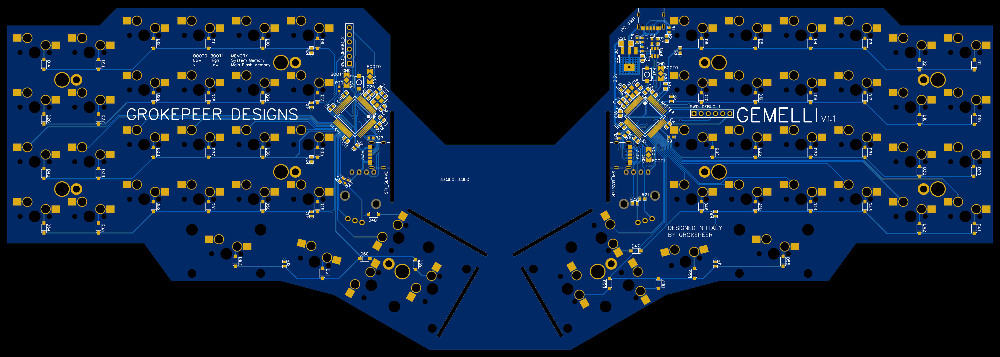

# Gemelli

A split keyboard with 58 keys, 2 encoders, 2 I2C displays and type C removable cables. The two boards are powered by two STM32F446. The two uC are connected together by an SPI line (through a USB C to USB C cable) to allow faster transmission rates for the displays. The firmware is completely custom, written in C but the board should support QMK's firmware aswell.

## PCB 2D Renderings

## Key Layout and Layers

The baked-in key layout on the custom firmware is as above. Note that the keyboard utilizes the multiple "layers" principle common to compact keyboard such as this one. In the middle of a key you will se the standard layer keybind, in the upper left corner the L1+shift, in the lower left the L1, in the lower right L2 while in the upper right corner is the L4. All layers except L4 are press-and-hold while L4 is a toggle layer that you can exit pressing L1+L2.

**To modify the layout** you can modify the maps in the master uC code and flash the updated firmware. Alternatively you can flash QMK and use their USB on-the-fly reprogramming to change layout.

## V2.0 Upgrades

This was one of the first PCB I designed, looking back I see many mistakes I made, some might not cause any problem, others should better be fixed:

- Redesign PCB paneling
- Remove ground pour from the breakable supports
- Add new debugging connectors
- Remove encoders
- Move mounting points from the plate to the PCB
- Firmware overhaul